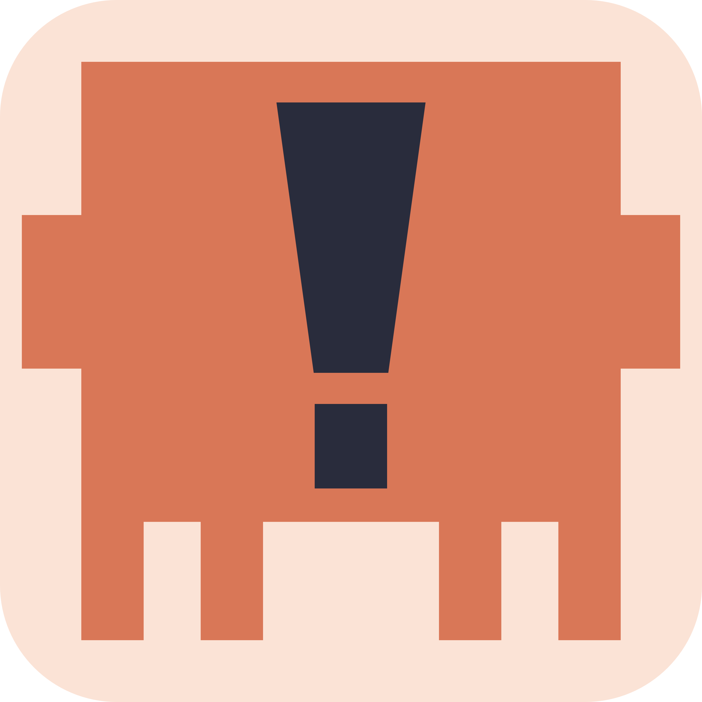
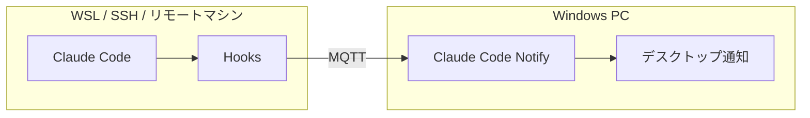
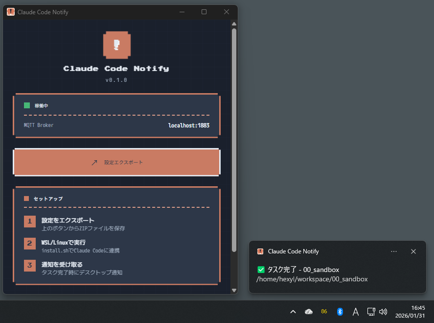

<div align="center">



# Claude Code Notify

**リモートの Claude Code からデスクトップ通知を受け取る**

[](LICENSE)
[](https://github.com/anthropics/claude-code)
[](https://tauri.app/)
[](https://www.rust-lang.org/)

[機能](#features) • [インストール](#installation) • [セットアップ](#setup) • [使い方](#usage) • [ライセンス](#license)

</div>

---

## なぜ Claude Code Notify？

WSL や SSH 先のリモートマシンで Claude Code を使っていると、タスクが完了しても気づかないことがありませんか？

**Claude Code Notify** は、リモートの Claude Code からリアルタイムで Windows デスクトップ通知を受け取れるアプリです。





<a name="features"></a>
## 主な機能

| 機能 | 説明 |
|------|------|
| **タスク完了通知** | Claude Code のタスクが完了したら即座に通知 |
| **承認依頼通知** | ツール実行の承認が必要な時に通知 |
| **入力要求通知** | 選択肢の提示やMCPツールなど、ユーザー入力が必要な時に通知 |
| **システムトレイ常駐** | 軽量でバックグラウンド動作 |
| **簡単セットアップ** | ワンクリックで設定ファイルをエクスポート |

<a name="installation"></a>
## インストール

### Windows 側（通知を受け取る側）

[Releases](https://github.com/hexylab/claude-code-notify/releases) から最新版をダウンロード:

- **インストーラー版**: `claude-code-notify_x.x.x_x64-setup.exe`
- **ポータブル版**: `claude-code-notify.exe`

または、ソースからビルド:

```bash
git clone https://github.com/hexylab/claude-code-notify.git
cd claude-code-notify
npm install
npm run tauri build
```

### Claude Code 側（WSL / リモート）

必要なパッケージ:

```bash
sudo apt install mosquitto-clients jq
```

<a name="setup"></a>
## セットアップ

### Step 1: Windows アプリを起動

`claude-code-notify.exe` を起動すると、システムトレイにアイコンが表示されます。

### Step 2: 設定をエクスポート

1. システムトレイアイコンを右クリック
2. 「設定エクスポート...」を選択
3. ZIP ファイルを保存

### Step 3: Claude Code 側にインストール

エクスポートした ZIP を Claude Code が動作しているマシンに転送し、展開:

```bash
unzip claude-code-notify-config.zip -d ~/claude-notify-setup
cd ~/claude-notify-setup
chmod +x install.sh
./install.sh
```

### Step 4: Claude Code を再起動

```bash
claude
```

これで完了です！

<a name="usage"></a>
## 使い方

セットアップ後は、Claude Code を使うだけで自動的に通知が届きます。

### 通知の種類

| 通知 | フック | 説明 | 表示例 |
|------|--------|------|--------|
| **タスク完了** | `Stop` | Claude の応答が完了した時 | ✅ タスク完了 - project-name |
| **承認依頼** | `PermissionRequest` | ツール実行の許可ダイアログが表示された時 | ⚠️ 承認依頼 - Bash: npm install |
| **入力要求** | `Notification` | 選択肢の提示やMCPツールなど、ユーザー入力が必要な時 | 💬 入力が必要です |

**入力要求通知の対象**:
- Plan Mode での選択肢提示（AskUserQuestion）
- MCPツールからの入力要求
- その他 Claude からの質問

## 技術スタック

- **フレームワーク**: [Tauri v2](https://tauri.app/)
- **言語**: Rust + TypeScript
- **通信**: MQTT (組み込みブローカー)
- **クライアント**: mosquitto-clients

## 必要な環境

### Windows（通知を受け取る側）
- Windows 10/11
- WebView2 Runtime（Windows 11 は標準搭載）

### Claude Code 側
- mosquitto-clients
- jq

## ファイアウォール設定

Windows ファイアウォールで TCP 1883 ポートを許可してください:

```powershell
netsh advfirewall firewall add rule name="Claude Code Notify MQTT" dir=in action=allow protocol=TCP localport=1883
```

## トラブルシューティング

| 問題 | 解決方法 |
|------|----------|
| 通知が届かない | ファイアウォールで 1883 ポートを許可 |
| 接続エラー | Windows 側のアプリが起動しているか確認 |
| IP アドレスが変わった | 設定を再エクスポートして再インストール |

## 開発

```bash
# 開発モード
npm run tauri dev

# ビルド
npm run tauri build

# テスト
cd src-tauri && cargo test
```

<a name="license"></a>
## ライセンス

MIT License - 詳細は [LICENSE](LICENSE) を参照してください。

---

<div align="center">

**[⬆ トップに戻る](#claude-code-notify)**

Made with Rust and Tauri

</div>
