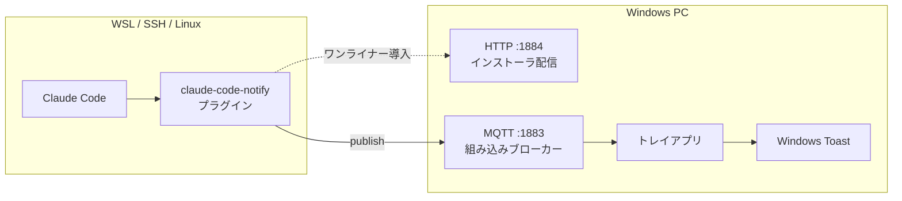

<div align="center">


# Claude Code Notify

**リモートで働く Claude Code から、Windows に通知が飛んでくる。**

[](LICENSE)
[](https://github.com/anthropics/claude-code)
[](https://tauri.app/)
[](https://www.rust-lang.org/)

</div>

---

## ⏱️ Claude Code、放置してませんか？

WSL や SSH 先で Claude Code を走らせて別作業をしていると、
**タスクはとっくに完了していた。承認ダイアログに気づかず数分ロスした。**
—— そんな経験、ありませんか？

**Claude Code Notify** は、その「気づけなさ」を消す小さな常駐アプリです。
リモートで動く Claude Code から、Windows のデスクトップ通知として即座に知らせます。

## ✨ 3 種類の通知

| | トリガー | 通知イメージ |
|---|---|---|
| ✅ **タスク完了** | Claude の応答が終わった瞬間 | `✅ project-name のタスクが完了しました` |
| ⚠️ **承認依頼** | ツール実行の承認が必要なとき | `⚠️ Bash: npm install を実行してもいい？` |
| 💬 **入力要求** | 選択肢提示や MCP の対話など | `💬 入力が必要です` |

Windows のトースト通知 + トレイアイコンの状態表示で届きます。

---

## 🚀 使い始めるまで 30 秒

### 1. Windows 側: アプリを起動

[Releases](https://github.com/hexylab/claude-code-notify/releases) から最新の `Claude Code Notify_x.x.x_x64-setup.exe` をダウンロードして実行。
タスクトレイに常駐し、導入用 HTTP サーバー (`:1884`) と MQTT ブローカー (`:1883`) が自動で立ち上がります。

### 2. Claude Code 側: ワンライナー

アプリ画面に表示されたコマンドを実行するだけです。

**Linux / WSL:**
```bash
curl -fsSL http://<Windows IP>:1884/install.sh | bash
```

**Windows (PowerShell):**
```powershell
iwr -useb http://<Windows IP>:1884/install.ps1 | iex
```

### 3. Claude Code を再起動

そのまま `claude` を起動すれば、次のタスクから通知が飛んできます。
設定ファイルを手で書き換える必要はありません。

---

## 💡 `settings.json` を汚さないインストール

v0.4.0 から、Claude Code Notify は **Claude Code プラグインとして** インストールされます。

- ✅ `~/.claude/settings.json` の **`hooks` セクションには一切書き込まない**
- ✅ プラグイン一式は `~/.claude-notify/plugin/` に隔離される
- ✅ アンインストールはワンライナーで完全クリーンアップ
- ✅ 旧 v0.3 系の hooks エントリは自動マイグレーションで除去

あなたの手書き hooks と競合することはもうありません。

---

## 🗺️ しくみ


```mermaid
flowchart LR
    subgraph Remote["WSL / SSH / Linux"]
        CC[Claude Code]
        Plugin["claude-code-notify<br/>プラグイン"]
    end

    subgraph Win["Windows PC"]
        HTTP["HTTP :1884<br/>インストーラ配信"]
        MQTT["MQTT :1883<br/>組み込みブローカー"]
        App[トレイアプリ]
        Toast[Windows Toast]
    end

    CC --> Plugin
    Plugin -. ワンライナー導入 .-> HTTP
    Plugin -->|publish| MQTT
    MQTT --> App
    App --> Toast
```

| ポート | 用途 |
|---|---|
| TCP **1883** | MQTT ブローカー（通知の本線） |
| TCP **1884** | HTTP 経由のインストーラ・バイナリ配信 |

Windows Firewall で両方のポートを許可してください。

---

## 📋 必要な環境

| | 要件 |
|---|---|
| **Windows 側** | Windows 10/11、WebView2 Runtime（Win11 は標準搭載） |
| **Claude Code 側** | `claude` CLI（Claude Code 本体）、`curl` |

Linux / WSL / Windows いずれからも導入できます。

---

## 🔧 アンインストール

```bash
# Linux / WSL
curl -fsSL http://<Windows IP>:1884/uninstall.sh | bash

# Windows (PowerShell)
iwr -useb http://<Windows IP>:1884/uninstall.ps1 | iex
```

プラグイン登録、プラグインディレクトリ、旧版の残骸まで一気に消えます。

---

## 🛠️ 開発

```bash
# ホットリロード付き開発モード
npm run tauri dev

# リリースビルド
npm run tauri build

# テスト
cd src-tauri && cargo test
```

アーキテクチャや内部モジュールの詳細は [CLAUDE.md](CLAUDE.md) を参照してください。

---

## 🩹 トラブルシューティング

| 症状 | 確認ポイント |
|---|---|
| 通知が届かない | `curl http://<Windows IP>:1884/health` が `{"status":"ok"}` を返すか |
| `claude plugin install` が失敗 | `claude --version` が動くか、PATH 設定を確認 |
| バイナリが 404 | Windows 側アプリが起動しているか／ファイアウォールで 1883・1884 が開いているか |
| IP アドレスが変わった | `uninstall.sh` → `install.sh` で入れ直し |

---

## ライセンス

MIT License — 詳細は [LICENSE](LICENSE) を参照してください。

<div align="center">

Made with Rust & Tauri

</div>
